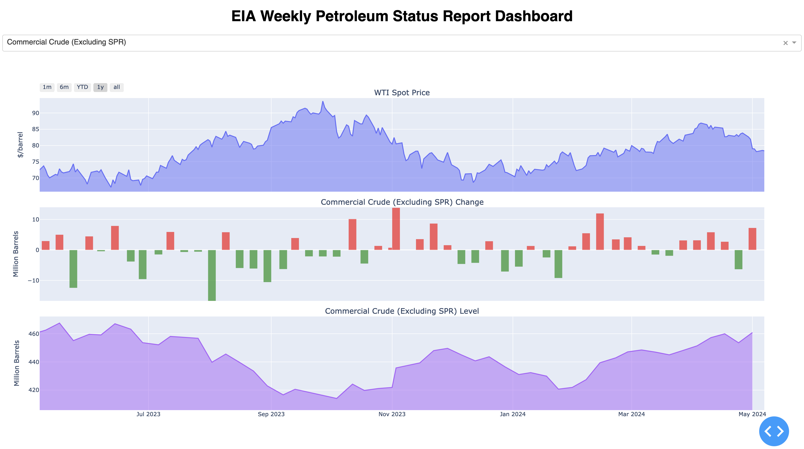

# eia-webapp-docker
<i>A lightweight web application to retrieve EIA Weekly Petroleum Supply Reports and generate an in-browser interactive dashboard visualisation using Dash and Plotly.

## Instructions
### Clone the repository
<code>git clone https://github.com/kinghfs/eia-webapp-docker.git</code>

### Using Docker
#### Build the Docker image
In the command line, execute:
<code>docker build -t python-eia-dashboard .</code>

#### Run the image in a container
<code>docker run -p 8050:8050 python-eia-dashboard</code>

#### View dashboard in browser
Navigate to localhost:8050 in your browser.

### Without Docker
#### Installing dependencies
Run <code>pip install -r requirements.txt</code> in the command line to install dependencies.

#### Check for newly released reports
Run <code>python3 async_scrape_eia.py</code>

#### View dashboard in browser
Run <code>python3 app.py</code>, browse to localhost:8050 to view dashboard.
