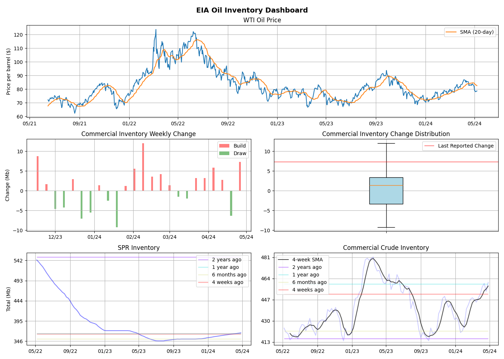

# eia-webapp-docker
<i>A lightweight web application to retrieve EIA Weekly Petroleum Supply Reports and generate an in-browser dashboard visualisation using Flask.

## Instructions
### Clone the repository
<code>git clone https://github.com/kinghfs/eia-webapp-docker </code>

### Build the Docker image
In the command line, execute:
<code>docker build -t python-eia-dashboard .</code>

### Run the image in a container
<code>docker run -p 5000:5000 python-eia-dashboard</code>

### View dashboard in browser
Navigate to https://localhost:5000
